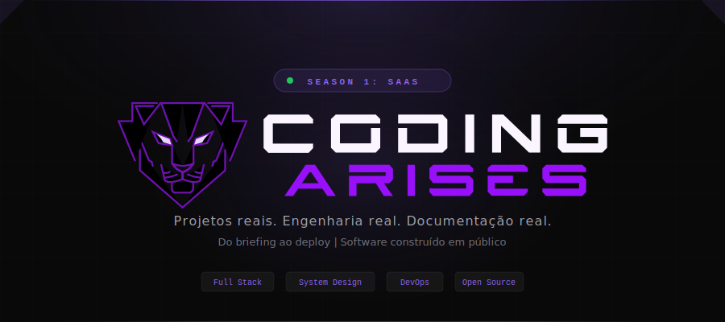
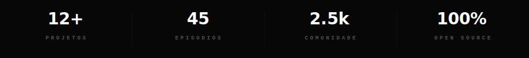
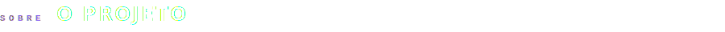
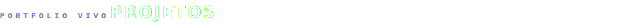
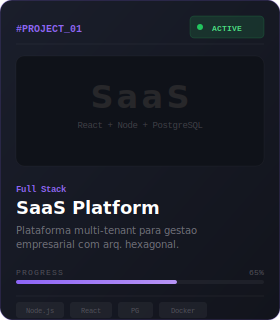
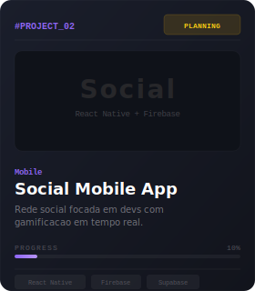
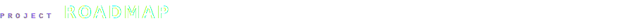
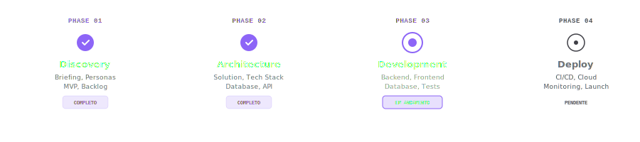
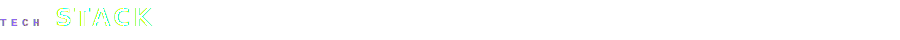

<!-- Header Banner SVG -->

<!-- Divider Neon -->

<!-- Stats Bar -->

<!-- Divider Neon -->

 

<!-- Section: Sobre -->

**Coding Arises** é um estúdio público de construção de software. Aqui, cada projeto é desenvolvido do zero — do briefing ao deploy — com toda a engenharia, arquitetura e documentação expostas em tempo real.

O formato segue **temporadas e episódios**: cada temporada é um projeto completo, e cada episódio cobre uma etapa real do desenvolvimento — desde a descoberta de produto até a infraestrutura em produção.

> *"Um laboratório aberto de engenharia de software onde você acompanha cada decisão, cada linha de código e cada deploy."*

 

### O Que Você Encontra Aqui

<table>
<tr>
<td width="50%" valign="top">

**Projetos Full Stack** — Aplicações completas construídas do zero ao deploy, com arquitetura real, testes e infraestrutura de produção.

**System Design & Arquitetura** — Decisões técnicas documentadas, diagramas de solução, modelagem de dados e contratos de API.

</td>
<td width="50%" valign="top">

**Documentação de Engenharia** — Technical Briefs, ADRs, Specs, Implementation Records — o processo completo de engenharia exposto.

**Templates, Blueprints & Roadmaps** — Artefatos reutilizáveis para iniciar seus próprios projetos com qualidade profissional.

</td>
</tr>
</table>

 

<!-- Divider Neon -->

 

<!-- Section: Projetos -->

 

<table>
<tr>
<td align="center" valign="top">

 <b>Season 1</b> · 8 episódios
</td>
<td align="center" valign="top">

 <b>Season 2</b> · 2 episódios
</td>
<td align="center" valign="top">

 <b>Season 0</b> · 12 episódios
</td>
</tr>
</table>

 

<!-- Divider Neon -->

 

<!-- Section: Roadmap -->

 

 

<!-- Divider Neon -->

 

<!-- Section: Stack -->

 

**Frontend**

**Backend**

**DevOps & Cloud**

 

<!-- Divider Neon -->

 

### Como Acompanhar

1. **Explore os repositórios** — Cada projeto tem seu próprio repo com todo o código e documentação
2. **Assista os episódios** — No [YouTube](https://youtube.com/@codingarises), cada etapa é gravada e explicada
3. **Leia a documentação** — Technical Briefs, ADRs e Specs estão disponíveis em cada projeto
4. **Participe da comunidade** — Sugira projetos, vote em features e colabore com outros engenheiros
5. **Use os templates** — Blueprints e artefatos reutilizáveis para seus próprios projetos

 

### Conecte-se

&nbsp;&nbsp;

&nbsp;&nbsp;

&nbsp;&nbsp;

 

<!-- Footer Banner SVG -->

